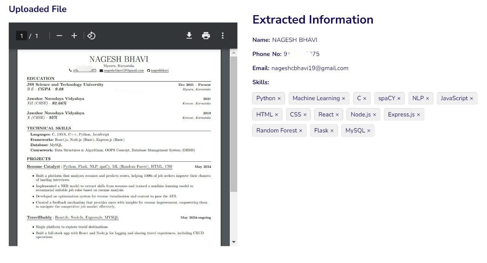

# Resume Catalyst

## Project Overview
Resume Catalyst is a smart resume analyzer that helps job seekers create impactful resumes and stand out in the competitive job market. By leveraging advanced technologies such as PDFMiner for text extraction, NLP-based NER models for information extraction, and Random Forest algorithms for resume categorization and job role prediction, the system enhances resume quality and alignment with job market demands.

## Features
- **Resume Parsing:** Extracts key information such as name, contact details, and skills from the uploaded resume.
- **Resume Score Prediction:** Evaluates the resume based on impact, brevity, and section scores.
- **Resume Categorization:** Classifies resumes into different categories to identify relevant job roles.
- **Job Recommendation:** Provides personalized job role predictions.
- **Skill Development:** Offers course recommendations for skill improvement using the Gemini-Pro generative AI model.

## Technologies Used
- **Backend:** Flask
- **Frontend:** HTML, CSS
- **NLP Models:** Named Entity Recognition (NER)
- **Machine Learning:** Random Forest
- **Text Extraction:** PDFMiner
- **Generative AI:** Gemini-Pro

## Installation

### Prerequisites
- Python 3.x
- Flask
- PDFMiner
- scikit-learn
- Jinja2

### Setup
1. Clone the repository:
    ```bash
    git clone https://github.com/yourusername/resume-catalyst.git
    cd resume-catalyst
    ```

2. Create a virtual environment:
    ```bash
    python -m venv venv
    source venv/bin/activate  # On Windows use `venv\Scripts\activate`
    ```

3. Install the required packages:
    ```bash
    pip install -r requirements.txt
    ```

4. Run the application:
    ```bash
    python app.py
    ```

5. Open your browser and navigate to `http://127.0.0.1:5000/` to use the application.

## Usage
1. Upload your resume in PDF format.
2. The system will extract information, evaluate the resume, and display the impact, brevity, and section scores.
3. View personalized job recommendations and skill development courses.

## Screenshots
### Landing page:

### Uploading the Resume:

### Uploaded Resume with Extract Information from NLP Model

### Display of Resume Score:


### Video recommendation for Resume score Optimization: 

### Resume Categorization and Job Role Prediction along with Extra Skills and Course Recommendation: 


 


## Contributing
We welcome contributions to enhance the features and improve the system. Please follow the standard GitHub fork and pull request workflow.

## License
This project is licensed under the MIT License. See the [LICENSE](LICENSE) file for more details.

## Acknowledgements
Special thanks to our project advisors and everyone who contributed to the development of this system.

